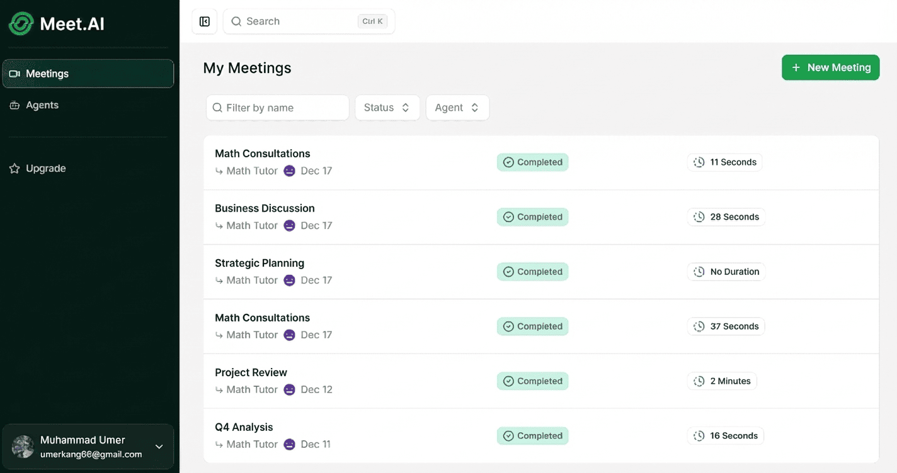
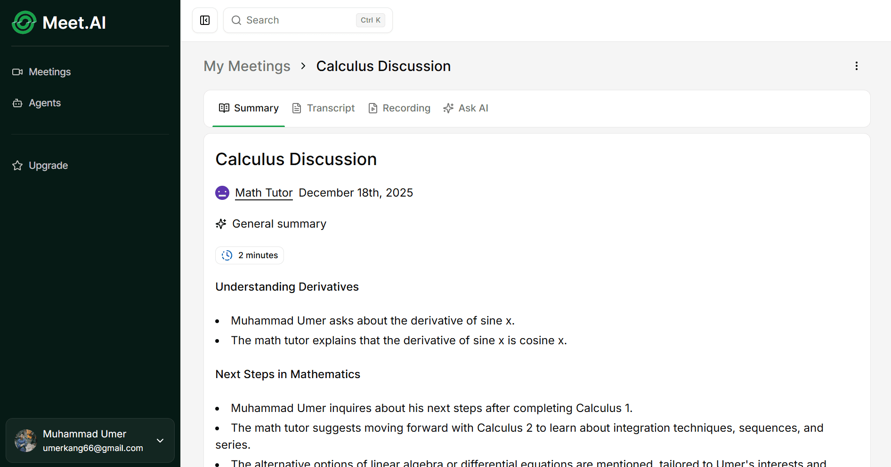
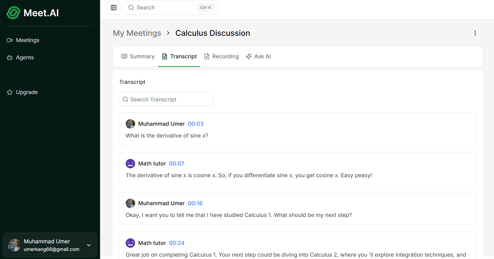

# MeetAI

MeetAI is an intelligent meeting assistant powered by AI that helps you capture, summarize, and analyze your meetings seamlessly. Built with modern technologies, it provides a comprehensive suite of tools to enhance your productivity.

## ✨ Features

### 1. Dashboard & Meeting Management
Organize and access all your past and upcoming meetings from a centralized dashboard.


### 2. AI-Powered Summaries
Instantly generate concise and accurate summaries of your discussions, ensuring you never miss key takeaways.


### 3. Full Transcripts
Access detailed, time-stamped transcripts of every conversation for easy reference and review.


### 4. Live Meeting Interface
Experience high-quality video conferencing with integrated tools for a seamless meeting experience.


### 5. Interactive Chat
Engage with your meeting data through an intelligent chat interface to quickly find specific information or ask questions about the discussion.


## 🛠️ Tech Stack

- **Framework:** [Next.js 15](https://nextjs.org/)
- **Database:** [Neon](https://neon.tech/) with [Drizzle ORM](https://orm.drizzle.team/)
- **Authentication:** [Better Auth](https://www.better-auth.com/)
- **Real-time Video:** [Stream IO](https://getstream.io/)
- **AI Agents:** [Inngest](https://www.inngest.com/) & [OpenAI](https://openai.com/)
- **Styling:** [Tailwind CSS](https://tailwindcss.com/) & [Chad CN](https://ui.shadcn.com/)

## 🚀 Getting Started

1.  **Install dependencies:**
    ```bash
    npm install
    ```

2.  **Set up environment variables:**
    Copy the example env file (if available) or create a `.env` file with necessary keys (Database URL, API keys, etc.).

3.  **Run the development server:**
    ```bash
    npm run dev
    ```

4.  **Open the app:**
    Visit [http://localhost:3000](http://localhost:3000) in your browser.
